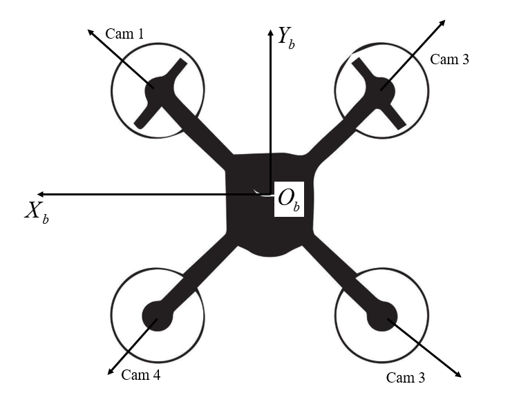

# Data collection from RflySim

This repository provides configuration files and Python scripts for data collection in RflySim (Version 3.07 full edition). 

## 📁 Dataset Structure

The dataset is organized hierarchically and consists of two main folders:

* `dataset`: collected dataset from RflySim.
    * `scenexxx`: one folder for each scene, where `xxx` is the scene number.
        * `trajxxx`: one folder for each trajectory, where `xxx` is the trajectory number.
            * `images`: named in the format of `imgs_{camera_id}_{timestamp}.jpg`, where `camera_id` is the index of the camera (0-3), and `timestamp` is the timestamp of the image.
            * `labels`: named in the format of `label_{timestamp}.txt`, where `timestamp` is the timestamp of the label. The format of the label if `timestamp, x, y, z, vx, vy, vz, roll(rad), pitch(rad), yaw(rad), wx, wy, wz (data of PX4)`.
            * `cam_infos.txt`: camera information file. The format of each line is `mapping_coeffients_i(4x1), ImageSize_i(2x1), Distortion_Center_i(2x1), StretchMatrix_i(4x1), roll_i(reg), pitch_i(reg), yaw_i(reg), tx_i(m), ty_i(m), tz_i(m)`. There are **4** lines in total where each line represents one camera. The pose of the camera is represented in the **NED frame**.
* `config`: configuration files for RflySim.
    * `Config.json`: configuration file for RflySim, mainly for four fisheye cameras here.
    * `scenexxx.bat`: one-click startup script for RflySim, where `xxx` is the scene number.
* `getRflysimData.py`: Python script for data collection from RflySim. The users can run the script after modifying `ind_scene` and `ind_traj`, which are the index of scenes and trajectories, respectively. The script will start RflySim and record the data. 

## ⚙️ Configuration

* `camera`: Four fisheye cameras with fov of 200°, width of 640 pixels, height of 640 pixels are deployed in RflySim. The arrangement of the fisheye cameras: the angles between each other are 90°, and lie in the drone's XoY plane, similar to [OmniNxt](https://ieeexplore.ieee.org/document/10802134). The reader can refer to: 
    * `cam1`: front-right
    * `cam2`: back-right
    * `cam3`: back-left
    * `cam4`: front-left
* `collection`: The frequency of data collection is 20Hz.

## 📌 Related coordinate systems in RflySim

* `NED`: North-East-Down, the reference coordinate system in RflySim for the description of movements of drones. The origin of the coordinate system is at the **initial point of the drone**.
* `Body Coordinate System (BCS)`: The x-axis points forward, the y-axis points to the right, and the z-axis points downward. The origin of the coordinate system is at the center of the drone. **The pose of the drones is the pose of BCS relative to NED.**
* `Camera Coordinate System (CCS)`: The x-axis points forward and is vertical to the imaging plane, the y-axis points to the right, and the z-axis points downward. The origin of the coordinate system is at the center of the imaging plane. **The pose of the camera in the `Config.json` file is the pose of CCS relative to BCS.**

## 🚀 Usage

1. Configure parameters of cameras in `./config/Config.json`.
2. Configure parameters of the scene in `./config/scenexxx.bat`.
3. Run `./getRflysimData.py` after configuring `ind_scene` and`ind_traj`. Then RflySim will start. Finally, setting waypoints in QGC to control the drone while Python script records data.